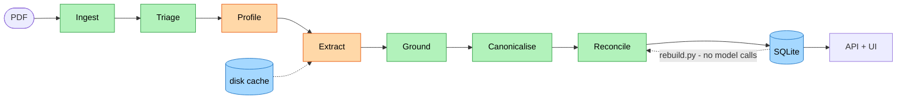

# Fact Knowledge Layer

Extracts qualified factual claims from PDFs, grounds every claim in the exact
text that supports it, and reconciles claims across documents — reporting not
just *that* two figures differ, but **why**, with the derivation shown.

> **The idea in one sentence.**
> A contradiction is a claim about **qualifiers**, not about values. Two numbers
> differing is only a conflict if they cover the same period, scope, basis and
> entity.

---

## Setup and run instructions

### 1 · Browse the results — no API key needed

A pre-built database of the full run is committed, so you can inspect
everything immediately. Reading and reconciling make **no model calls**.

```bash
git clone https://github.com/Naman-GG/KnowMe.git
cd KnowMe

uv venv --python 3.12 && uv pip install -e ".[dev]"
# no uv?  python3 -m venv .venv && .venv/bin/pip install -e ".[dev]"

.venv/bin/python -m pytest -q                 # 95 tests, none hit the network

mkdir -p data && cp sample/factlayer.db data/ # 6 documents, 1,700 claims
.venv/bin/python scripts/demo.py              # the four required cases
.venv/bin/python -m uvicorn factlayer.api:app --app-dir src
```

Then open **<http://127.0.0.1:8000>** and click **“The four cases”**.

### 2 · Run it on your own PDFs — key needed

Any OpenAI-compatible endpoint works. The default targets **Groq's free tier**.

```bash
cp .env.example .env
# set FACTLAYER_LLM_API_KEY   (GROQ_API_KEY / OPENAI_API_KEY are also read)

.venv/bin/python scripts/ingest.py --all            # both starter corpora
.venv/bin/python scripts/ingest.py path/to/your.pdf # or any PDF
```

Or use the **Add PDF** button in the UI — same pipeline.

### 3 · Other commands

| Command | Does |
|---|---|
| `scripts/demo.py` | Prints the four required cases from live data |
| `scripts/audit.py` | Adversarial audit — hunts for the system's own failures |
| `scripts/rebuild.py` | Re-normalise + re-reconcile stored claims, **no model calls** |
| `scripts/refresh_subjects.py` | Re-profile documents, propagate corrected subjects |
| `scripts/eval_triage.py --sweep` | Page-selection recall vs page budget |

> **On rate limits.** Groq's free tier allows **200,000 tokens/day**; extraction
> costs ~4,000 per page and the corpus is 511 pages — several days of free
> allowance. Every call is content-hash cached, so re-runs are instant and an
> interrupted run resumes. When the daily allowance runs out the pipeline stops
> retrying, finishes on cached work, and reports `pages_skipped_no_quota`
> instead of implying full coverage.

---

## Video demo

**[Watch the demo (3 min)](https://drive.google.com/file/d/1BCrYJ-SxB_eIEvVIzww_aBUWG4izg4UD/view?usp=sharing)**

Covers a PDF being processed and all four required cases: a cross-document
corroboration, a genuine contradiction, an apparent contradiction explained by
context, and an extraction failure that was found and handled.

---

## Results on the starter corpus

```
6 documents  ·  1,700 claims (1,589 active, 111 quarantined)
1,144 relations  ·  307 cross-document  ·  1,001 distinct measures
grounding 93.5%  (435 exact · 754 normalised · 400 elided)
quarantined 111  (65 quote absent from its page · 46 evidence too short to check)
verdicts: 611 underspecified · 488 complementary · 28 contradicts · 17 corroborates
```

`scripts/demo.py` finds all four cases by searching for the **shape** of the
derivation. No document, figure or page is hardcoded.

### Case 1 — corroborated across documents

Two independent institutions, phrased and spelled differently:

```
[CORROBORATES] core inflation
   3.5 per cent   RBI Annual Report   period = '2024-25'
   3.5 percent    IMF Article IV      period = 'FY2024/25 average'
   period check:  both resolve to [2024-04-01 → 2025-03-31]
```

And across units, with the reported/adjusted distinction preserved:

```
[CORROBORATES] reported EBITDA    127 ₹ Cr  vs  1,266.41 ₹ Million
[CORROBORATES] adjusted EBITDA     76 ₹ Cr  vs    757.86 ₹ Million
```

### Case 2 — a genuine contradiction

Same measure, period, scope and basis; values 8.7% apart, nothing explains it:

```
[CONTRADICTS] loss before tax
   -8,987.45 ₹ million   prospectus p.94    "Restated loss before tax (8,987.45)"
   -9,839.09 ₹ million   prospectus p.103   "Loss before tax (V= III+IV) (9,839.09)"
```

### Case 3 — apparent contradiction, explained

Three distinct mechanisms, all demonstrable:

- **Period containment** — Q4 FY24 nested in FY24, arithmetic check confirms
  176,000,000 ≤ 740,000,000
- **Reporting basis** — EBITDA ₹127 Cr vs *adjusted* EBITDA ₹76 Cr
- **Disjoint periods** — figures covering spans that never overlap

### Case 4 — failures found and handled

- **111 quarantined**, reported as two distinct kinds:
  - **65** — quote absent from the page it cites *(the model inventing evidence)*
  - **46** — evidence too short to check. A bare `3.28` *does* appear on its
    page, but it would appear on almost any page of a financial document.
    Unverifiable is not the same as invented; collapsing the two would have
    overstated the hallucination rate by ~70%
- **16/16 fabricated scopes** caught on a single slide
- An extraction error that **only cross-document reconciliation** could expose
  (see Findings)

---

## Approach

### Why the obvious design fails

The default shape is: chunk → extract triples → embed → pair neighbours → ask an
LLM *“do these contradict?”*. Its central judgement is unauditable, and it is
wrong in a predictable way: it compares **values** while ignoring the
**context** that makes values comparable.

Delhivery's FY24 revenue appears as all of these:

| Figure | Qualifier that explains it | Source |
|---|---|---|
| ₹8,142 Cr | revenue from *services* | Q4 deck |
| ₹81,415.38 mn | revenue from *operations*, consolidated | Annual report |
| ₹74,540.82 mn | revenue from operations, **standalone** | Annual report, same page |
| ₹85,942.34 mn | **total income** (adds other income) | Annual report, MD&A |
| ₹2,076 Cr | **Q4 only** | Q4 deck |

A value-first system reports four contradictions. Every one is explained by a
qualifier, and the first two are the *same fact* in different units.

### The claim model

The atom is not a triple — it is a value plus the qualifiers that give it meaning:

```python
Claim(
  subject   = "Delhivery Limited",
  measure   = "revenue from operations",   # canonicalised against a growing registry
  quantity  = Quantity(low=81415.38, high=81415.38, unit_raw="INR million",
                       canonical_low=8.141538e10),        # rescaled to rupees
  qualifiers = Qualifiers(period = Period("FY24", 2023-04-01, 2024-03-31),
                          scope  = "consolidated",
                          basis  = None,
                          as_of  = 2024-08-01),           # inherited from the document
  evidence  = Evidence(doc, page=22, quote="...₹ 74,540.82 million...",
                       grounding=EXACT),
)
```

Two decisions do most of the work:

- **Numeric values are closed intervals.** A point estimate is `low == high`, so
  “does RBI's 6.5% agree with the Survey's 6.3–6.8%?” is plain interval
  containment. Periods get the same treatment, making period comparison
  interval algebra.
- **Four deep qualifier slots plus an open extension space.** `period`, `scope`,
  `basis` and `as_of` have real logic behind them. Anything else a document
  introduces lands in `extra` and is compared generically. The schema grows with
  the corpus without pretending to understand every new dimension.

### The reconciler decides; the model only reads

Values are compared **last**, and only once qualifiers establish that comparing
them means anything.

```
A: revenue from services = 8,142 Rs. Cr            [q4-deck]
B: revenue from services = 81,415.38 INR million   [annual-report]
  ✓ subject   'Delhivery Limited' ≡ 'Delhivery Limited'
  ✓ measure   both → canonical 'revenue_from_services'
  ✓ unit      'Rs. Cr' and 'INR million' both rescale to currency
  ✓ period    'FY24' [2023-04-01→2024-03-31] EQUALS 'FY24' [same]
  ✓ scope     unstated vs unstated → same
  ✓ value     differ by 0.006% (within rounding)
  ⇒ CORROBORATES
```

| Verdict | Condition |
|---|---|
| `CORROBORATES` | qualifiers compatible, values agree |
| `CONTRADICTS` | qualifiers compatible, values disagree |
| `COMPLEMENTARY` | qualifiers disjoint — both can be true |
| `SUPERSEDES` | same claim, later `as_of`; the world changed |
| `UNDERSPECIFIED` | a qualifier needed for the judgement is missing |

The brief asks for three relations. *Reconcile* splits into two genuinely
different mechanisms — disjoint context vs. time moving on — and
`UNDERSPECIFIED` is the honest fifth answer most systems guess at.

### Contradiction by arithmetic, not opinion

When one period contains another, or one scope subsumes another, a non-negative
additive quantity **must** satisfy an inequality:

```
  i period              'FY24' CONTAINS 'Q4 FY24'
  ✕ period-containment  part 90,000,000,000 exceeds whole 81,420,000,000
  ⇒ CONTRADICTS
```

The check knows its limits — it does not apply to margins, rates or ratios, nor
to measures that can go negative (see Findings).

### Deliberately not built

- **No graph visualisation.** The brief says a graph alone is not the solution,
  and a force-directed blob of a few thousand claims shows *that* things connect
  without showing *why*. The UI is a review queue instead.
- **No vector database.** ~10³ claims here; even 100 documents is ~30k vectors —
  a 46 MB array and milliseconds of brute-force cosine.
- **No embedding model deciding measure identity.** “Revenue from operations”,
  “revenue from services” and “total income” are near-identical in any embedding
  space and are *genuinely different measures*. Similarity proposes candidates;
  it never decides.
- **Not RAG.** RAG answers a question from retrieved chunks. Contradiction
  detection needs exhaustive pairwise comparison over normalised claims — asking
  RAG “is there a contradiction here?” only works if both conflicting statements
  land in the same context window. Retrieval is used here as a *blocking
  strategy*, not an answer generator.

### Architecture



**Orange stages call a model; green stages do not.** Only `Profile` (one call per
document) and `Extract` (one call per page) cost anything, and both only *read*.

| Stage | What it does |
|---|---|
| **Ingest** | PDF → pages with character offsets; doc id is a content hash, so re-uploading is a no-op |
| **Triage** | Generic fact-density scoring; drops covers, contents pages, blank leaves |
| **Profile** | Publisher, subject, date, default units and scope — inherited by that document's claims |
| **Extract** | Claims carrying a verbatim quote and decomposed qualifiers |
| **Ground** | Quote must be on the cited page and each qualifier supported; failures quarantined, not dropped |
| **Canonicalise** | Maps measure names into a registry that grows with the corpus |
| **Reconcile** | Units, then period, scope, basis — and *only then* values |

Three properties fall out of this shape:

- **Improving deterministic layers is free.** Claims keep the raw period and unit
  strings their documents used, so `scripts/rebuild.py` re-normalises,
  re-grounds and re-reconciles 1,700 stored claims in under a second with **no
  model calls**.
- **Incremental by construction.** Doc ids are content hashes and reconciliation
  blocks on (subject, measure), so a new document is compared only against
  claims sharing those keys. Adding the sixth never re-examined the first five.
- **A dynamic schema.** The measure registry started **empty** — no seeded
  vocabulary — and grew to **1,001 measures** across six documents.

### AI tools used

- **Claude Code (Opus)** — design discussion, implementation, test suite
- **`openai/gpt-oss-120b` via Groq** — extraction and adjudication, deliberately
  on a free tier so reviewers can run this without an account

---

## Findings

Full debugging record in [`docs/DECISIONS.md`](docs/DECISIONS.md); honest
self-audit in [`docs/LIMITATIONS.md`](docs/LIMITATIONS.md).

**The model spent 86% of its output budget thinking.**
`finish_reason: length` — 2,653 of 3,072 completion tokens were *reasoning*
tokens, truncating the JSON. The truncated output **still parsed as valid JSON**,
so 8 of 16 claims vanished with no error. Fixed with `reasoning_effort: low` and
treating truncation as a hard failure: 6 → 16 claims while tokens *fell* to
1,781. The fix then appeared to do nothing — the cache key hashed the prompt but
not the decoding parameters.

**The model fabricated a qualifier and would not stop.**
It tagged **all 16** claims on one slide with `scope = "standalone and
consolidated"` — a phrase appearing nowhere on the page — and kept doing so after
the prompt forbade it. Prompting was the wrong tool; grounding was extended from
quotes to **qualifiers**. A fabricated qualifier is more dangerous than a missing
one: a missing scope yields an honest `UNDERSPECIFIED`, an invented one yields a
confident comparison between claims that were never comparable.

**Requiring verbatim quotes discarded 62% of true claims.**
The model quotes `"Q4 FY23: 0.7%"` from a page reading `"Q4 FY23: ₹13 Cr /
0.7%"` — it *elides*, it does not invent. The right test is not “is this span
contiguous” but “**do all the quote's tokens appear, in order**”. Grounding went
**38% → 85%**.

**An arithmetic check that was wrong for profit.**
“A part cannot exceed the whole” fired on `Q3 FY24 EBITDA ₹109 Cr` vs `FY24
EBITDA ₹76 Cr` — but that inequality only holds for **non-negative** quantities,
and FY23 EBITDA was **−452 Cr**. Rather than hardcode which measures behave this
way, the system **reads it off the corpus**. Contradictions fell **41 → 3**.

**Publisher mistaken for subject — the failure that produces silence.**
RBI and IMF shared **zero** relations despite both reporting Indian GDP growth.
Profiling had recorded the RBI report's subject as its *publisher*, and all 198
of its claims inherited it. A wrong *value* surfaces as a contradiction; a wrong
*subject* produces **no output at all**, and nothing looks exactly like “these
documents have nothing in common”. Fixed by teaching profiling the distinction,
then propagating the correction without re-extraction — cross-document relations
96 → 111.

**An extraction error only cross-document reconciliation could catch.**
The deck yielded `express parcel shipments = 7,224 Mn`; the annual report says
**740 million**. The claim's own quote gives it away — the model read a figure
off a slide of several charts and attached it to the wrong label. **Grounding
could not catch this**: the quote really is on the page, so it verified as
`exact`. It took a second document disagreeing. That is the argument for building
a knowledge layer at all.

---

## Limitations and next steps

Full version in [`docs/LIMITATIONS.md`](docs/LIMITATIONS.md), which separates
what is principled from what is tuned to this corpus.

- **No labelled ground truth**, so there are **no real precision or recall
  numbers**. `eval_triage.py` reports 9/9, but those targets are spans I chose
  after reading the documents — a regression smoke test, not a benchmark.
- **The fiscal year is hardcoded to April–March.** Correct here; **wrong** for a
  US 10-K on an October–September year — and it would not error, it would
  silently mis-date the interval. Should be inferred per document.
- **Some prompt examples come from these corpora.** The measure-adjudication
  prompt teaches that `revenue from operations` ≠ `total income`. Real
  distinctions, but chosen after reading these documents.
- **Coverage is partial.** Five of six documents are represented, most from a
  capped page budget; the Economic Survey has **zero** claims.
- **Two fixes deliberately hide things.** Same-page suppression means a document
  contradicting itself twice on one page won't be flagged; the negative-capable
  exemption means a real part-exceeds-whole error in a profit measure goes
  undetected. Both cut false positives sharply; both cost recall.
- **Not deployable as-is.** Ingestion takes ~25 minutes per document at free-tier
  pacing while the upload endpoint is synchronous — a real deploy needs a job
  queue and a progress endpoint.

**Next, in order:** a labelled evaluation set · per-document fiscal-year
inference · table-aware extraction so row labels survive · claim-level rather
than document-level `as_of` · OCR for scanned PDFs.

---

## Additional notes

- **Everything runs on a free tier.** The default provider is Groq's free
  `openai/gpt-oss-120b`, so this can be evaluated without a paid account — and
  the committed `sample/factlayer.db` means it can be evaluated without any
  account at all.
- **511 pages is about six days of free allowance** (200k tokens/day, ~4k per
  page). Coverage is therefore partial and the pipeline reports exactly which
  pages it skipped rather than implying it read them.
- **The interesting reading is in `docs/`.**
  [`DECISIONS.md`](docs/DECISIONS.md) is the working log — including the dead
  ends, like a stratified page-selection scheme that scored *worse* and was
  deleted. [`LIMITATIONS.md`](docs/LIMITATIONS.md) separates what is principled
  from what is tuned to this corpus, and names the hardcoded assumption most
  likely to fail silently on an unfamiliar document.
- **`scripts/audit.py` is adversarial towards this system's own output.** It
  hunts for unparsed periods, unrecognised units, over-merged registry entries
  and suspiciously generic measure names — the shapes that indicate the pipeline
  got something wrong.
- **95 tests, none of which touch the network.** Every normaliser and every
  verdict is tested against figures that genuinely appear in the starter corpus,
  so the four required cases are pinned as a specification rather than a demo.
- **Several bugs in this repository were found by reading its own output**, not
  by writing tests first: a page cited as `p.740` in a 27-page deck, two
  partly-overlapping periods reported as corroborating, and a quarantine message
  that said "not found" for a figure that was plainly on the page. Each is
  written up where it was fixed.

---

## Repository layout

| Path | What it does |
|---|---|
| `src/factlayer/models.py` | Claim / Qualifiers / Evidence / Verdict schema |
| `src/factlayer/ingest.py` | PDF → pages with character offsets |
| `src/factlayer/triage.py` | Generic fact-density scoring |
| `src/factlayer/extract.py` | Document profiling + per-page claim extraction |
| `src/factlayer/ground.py` | Verifies quotes **and qualifiers** against source |
| `src/factlayer/normalize/` | Units, periods (interval algebra), scope lattice |
| `src/factlayer/registry.py` | Measure vocabulary that grows with the corpus |
| `src/factlayer/reconcile.py` | The five verdicts and the derivation traces |
| `src/factlayer/pipeline.py` | End-to-end, incremental ingestion |
| `src/factlayer/db.py` | SQLite store |
| `src/factlayer/api.py` + `web/` | API and the review UI |
| `scripts/` | `ingest`, `demo`, `audit`, `rebuild`, `refresh_subjects`, `eval_triage` |
| `docs/` | `DECISIONS.md`, `LIMITATIONS.md`, `architecture.excalidraw` |
| `sample/factlayer.db` | Pre-built results — browse without a key |
